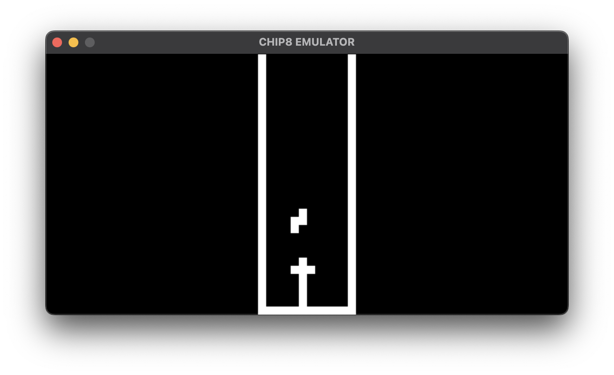
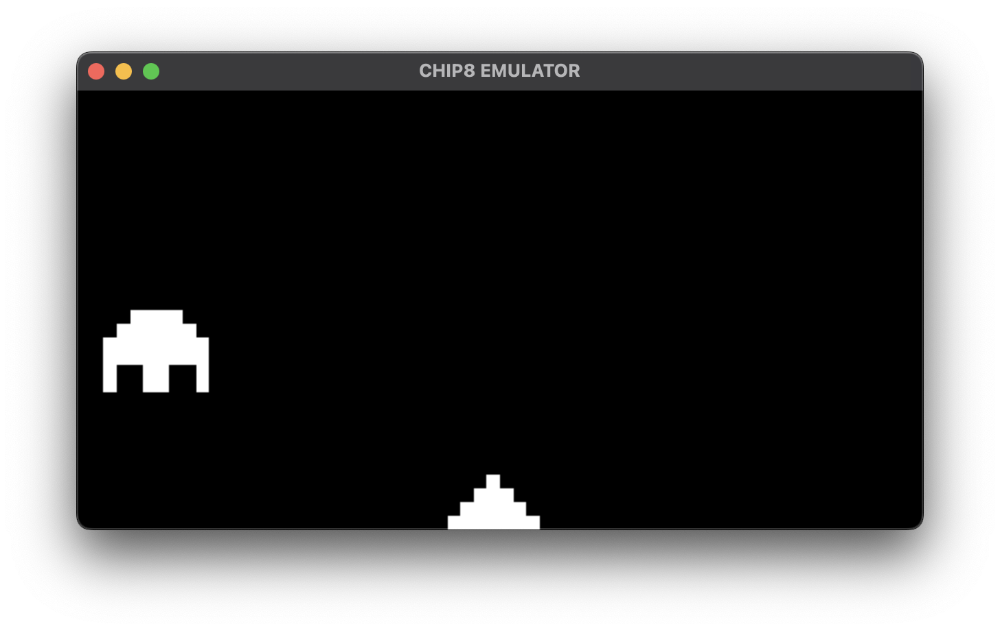
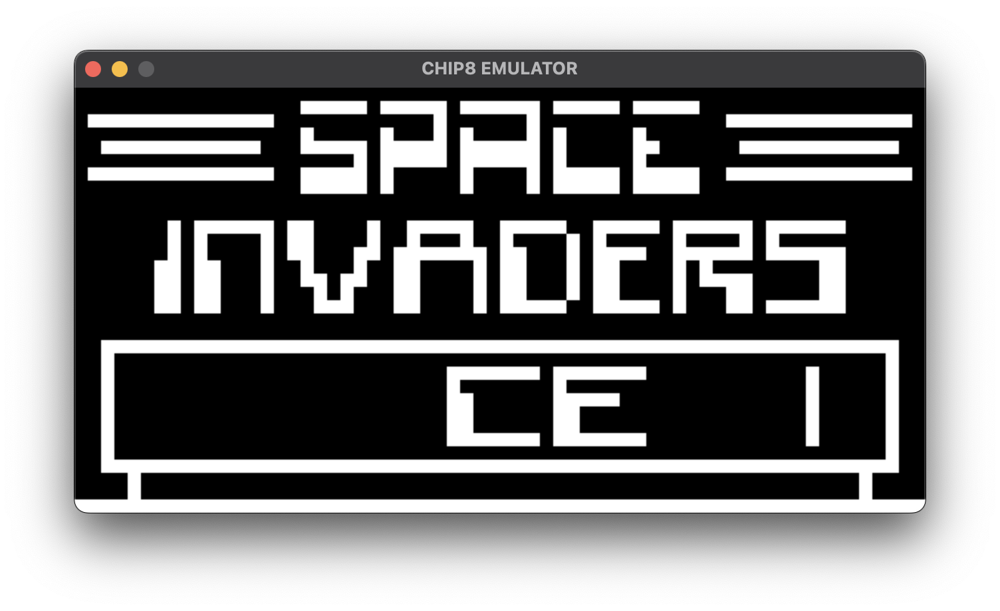

# About

This is an implementation of the CHIP-8 emulator using C++17, SDL2 (2D Texture) and SDL Audio.

# Usage

- Structure: `./build/chip8 <cyclesPerFrame> <frameDurationTargetMs> <pixelScale> <ROM_filepath>`
- Example: `./build/chip8 10 16 10 ./roms/Tetris_Fran_Dachille_1991.ch8`

|  |  |
|------------|------------|
|  |  |
|  |            |

# Installing SDL2 on MacOS

- `brew install sdl2`
- `sdl2-config --version`
- `2.26.1`
- `sdl2-config --cflags`
- `-I/usr/local/include/SDL2 -D_THREAD_SAFE`
- `sdl2-config --libs`
- `-L/usr/local/lib -lSDL2`

# If using GCC to compile and link

You need to inform `gcc` where to look for header files with the `-I` flag, and where to look for the compiled libraries with `-L` flag.
You can get both using the `sdl2-config` like for example `gcc ./src/*.c 'sdl2-config --libs --cflags' -Wall -lm -o build/app`.

# If using VSCode as IDE

You need to create/update the file `./vscode/c_cpp_properties.json` at the root of your project to inform the VSCode where to look for include files with the includePath property:

- `"includePath": ["${workspaceFolder}/**", "/usr/local/include/SDL2"],`
- `"includePath": ["${workspaceFolder}/**", "/opt/homebrew/include/SDL2"]`

Then your IDE should not complain about missing includes when using `#include <SDL.h>`.
